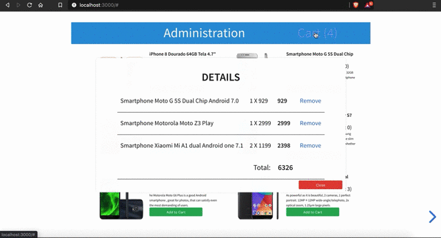

# Reactive Stack

A simple example for Reactive Full Stack eCommerce web app for each layer:
- Database: rethinkdb
- Backend: Express.js & Rxjs
- Frontend: Vue & RxJs & Reveal

## Preview


```
npx express-generator --view=ejs
npm install dotenv --save
npm install rx rxjs --save
npm install nodemon --save-dev

# babel-*  & webpack loaders...
npm install babel-polyfill babel-loader babel-preset-es2015 --save-dev
```

```
npx gitignore node
echo rethinkdb_data >> .gitignore
```

### Run the app
```
# run the db
rethinkdb

# run the app
npm run dev

# to create dummy products
http://localhost:3000/api/create

# Home page
http://localhost:3000

# Administration
http://localhost:3000/admin

# to delete all products
http://localhost:3000/api/delete
```

P.S. You'll need to create two tables (`products` and `carts`) for this demo, you do that from the RethinkDb admin console (at `http://localhost:8080` by default), or by executing these queries (default DB `test`): 
```
r.db('test').tableCreate('products').run(connection, function(err, result) {
    if (err) throw err;
    console.log(JSON.stringify(result, null, 2));
})

r.db('test').tableCreate('carts').run(connection, function(err, result) {
    if (err) throw err;
    console.log(JSON.stringify(result, null, 2));
})

```

### TODO:
- Clean up and remove duplicated code
- Use marblejs instead of express
- Use VueX & event bus
- Use Vuetify & Vuelidate (from https://github.com/bitsnaps/vuecommerce)
